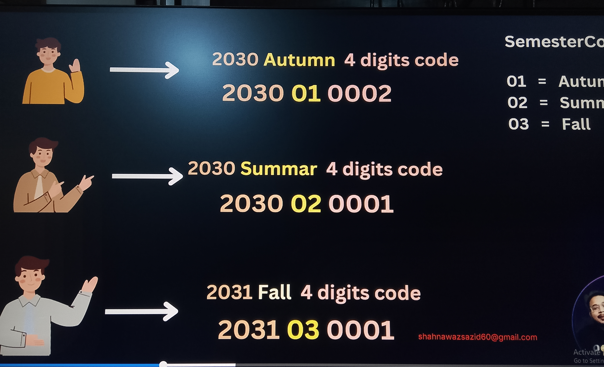
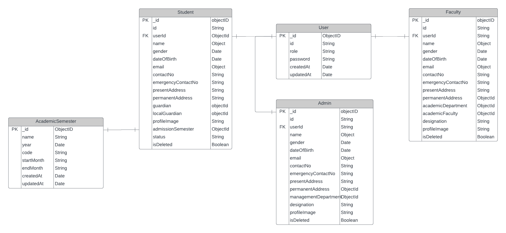
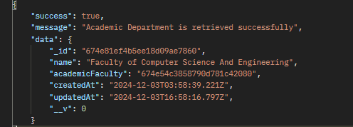

# Building University Management System Part-3

https://github.com/Apollo-Level2-Web-Dev/Level2-Batch4-PH-University-Server/tree/part-3

Requirement Analysis:

https://docs.google.com/document/d/10mkjS8boCQzW4xpsESyzwCCLJcM3hvLghyD_TeXPBx0/edit?usp=sharing

In Module 13,

We start by fixing previous bugs to ensure our code runs smoothly. We then create and validate the Academic Faculty interface and model, set up routes, controllers, and services, and test them using Postman. Next, we develop and validate the Academic Department interface and model, create controllers and routes, and test them with Postman. We handle validation for departments during creation and updates, learn to populate referencing fields, and implement the AppError class for better error management. We also explore transaction and rollback techniques, including deleting a student within a transaction. Finally, we learn how to dynamically update both primitive and non-primitive fields. This module helps you manage and validate complex data structures efficiently.

## 13-1 Fix your previous bugs

### Topics

- Bug Fix
- Academic Faculty CRUD
- Academic Department CRUD
- Transaction & Rollback
- Custom AppError
- Dynamic Update Primitive & Non Primitive Filed
- Faculty CRUD

- There is a bug in the code. The id should be reset when semester or year change



- We will take the full id and compare with current year with the last admitted students year, current semester code and last students semester code



## Populate method to get Referenced data



- Since the referencing shows only the id but we can not understand so we have to use populate method of mongoose

```ts
// getting data service
const getAllStudentsFromDB = async () => {
  const result = await Student.find()
    .populate('admissionSemester')
    .populate({
      path: 'academicDepartment',
      populate: {
        path: 'academicFaculty',
      },
    });
  // nested populate is done since academic faculty inside academic department is still showing id
  return result;
};
```

- Custom Error handler with statius code

```ts
// extending error

class AppError extends Error {
  public statusCode: number;

  constructor(statusCode: number, message: string, stack: '') {
    super(message);
    this.statusCode = statusCode;

    if (stack) {
      this.stack = stack;
    } else {
      Error.captureStackTrace(this, this.constructor);
    }
  }
}

export default AppError;
```

## 13-9 Implement transaction & rollback

### Transactions and Rollbacks (Simple Explanation)

#### What is a Transaction?

A transaction is like a small task or a set of steps that need to be done together to complete a job. If one step fails, the whole task fails. Think of it as a **"do everything or do nothing"** rule.

#### Example:

You want to transfer money:

1. Take money out of your account.
2. Put the money into your friend's account.

Both steps must happen together. If one step fails (like the second step), the first step is canceled too.

---

#### What is a Rollback?

A rollback means **undoing changes** if something goes wrong during the transaction. It makes sure everything goes back to how it was before the transaction started.

#### Example:

If the money is taken out of your account but doesn’t reach your friend’s account due to an error, the rollback will put the money back into your account.

---

#### Simple Idea:

- A **transaction** is a promise: “Do all the steps or none at all.”
- A **rollback** is the safety net: “If something breaks, fix everything by undoing changes.”

#### 4 principles of transaction Rollback

1. **Atomicity**: The entire transaction happens completely, or nothing happens at all.
2. **Consistency**: Ensures the database moves from one valid state to another, maintaining all rules and constraints.
3. **Isolation**: Transactions run independently without affecting each other, even if they are executed simultaneously.
4. **Durability**: Once a transaction is completed, its changes are permanent, even if the system crashes.

#### When We Will Use Transaction?

- Two or More database write operation
- We are writing in user and student collection at a time
- To use transition rollback we can use startSession() of mongoose
- startSession() will give isolated environment
- We have to use startSession() to start the session If all the process is successful we have to use commitTransaction() and endSession()
- If Fails we have to use abortTransaction() endSession()

```ts
import mongoose from 'mongoose';
import config from '../../config';

import { AcademicSemester } from '../academicSemester/academicSemester.model';
import { TStudent } from '../students/student.interface';
import { Student } from '../students/student.model';
import { TUser } from './user.interface';

import { User } from './user.model';
import { generateStudentId } from './user.utils';
import AppError from '../../errors/AppError';
import httpStatus from 'http-status';

const createStudentInDB = async (payload: TStudent, password: string) => {
  // create a user object
  const userData: Partial<TUser> = {};

  // if password is not given use default password
  //   if (!password) {
  //     user.password = config.default_password as string;
  //   } else {
  //     user.password = password;
  //   }
  userData.password = password || (config.default_password as string);

  //   console.log('password:', password);
  // console.log(studentData);

  // set student role
  userData.role = 'student';

  // find academic semester info
  const admissionSemester = await AcademicSemester.findById(
    payload.admissionSemester,
  );

  if (!admissionSemester) {
    throw new Error('There Is No Admission Semester');
  }
  const session = await mongoose.startSession();

  try {
    session.startTransaction();

    userData.id = await generateStudentId(admissionSemester);
    //    create a user (transaction-1)
    //  we have to give data for transaction as array previously it is array
    const newUser = await User.create([userData], { session });

    //    create a student
    if (!newUser.length) {
      throw new AppError(httpStatus.BAD_REQUEST, 'Failed To Create User', '');
    }
    //  set id, _id as user
    payload.id = newUser[0].id; //embedding id
    payload.user = newUser[0]._id; //reference _d

    // as in 0 index the new user data will exists

    //    create a student (transaction-2)
    const newStudent = await Student.create([payload], { session });

    if (!newStudent.length) {
      throw new AppError(
        httpStatus.BAD_REQUEST,
        'Failed To Create Student',
        '',
      );
    }

    await session.commitTransaction();
    await session.endSession();

    return newStudent;
  } catch (err) {
    console.log(err);
    await session.abortTransaction();
    await session.endSession();
    throw new Error('Failed to create student');
  }
};

export const UserServices = {
  createStudentInDB,
};
```

## 13-10 Delete student using transaction & rollback

```ts
// delete single student from db
const deleteStudentFromDB = async (id: string) => {
  const session = await mongoose.startSession();

  try {
    session.startTransaction();

    const deletedStudent = await Student.findOneAndUpdate(
      { id },
      { isDeleted: true },
      { new: true, session },
    );
    if (!deletedStudent) {
      throw new AppError(
        httpStatus.BAD_REQUEST,
        'Failed To Delete Student',
        '',
      );
    }

    const deletedUser = await User.findOneAndUpdate(
      { id },
      { isDeleted: true },
      { new: true, session },
    );
    if (!deletedUser) {
      throw new AppError(httpStatus.BAD_REQUEST, 'Failed To Delete User', '');
    }

    await session.commitTransaction();
    await session.endSession();

    return deletedStudent;
  } catch (err) {
    console.log(err);
    await session.abortTransaction();
    await session.endSession();
  }
};
```

## 13-11 Dynamically update both primitive & non primitive fields

- for data get update and delete (for user end we will use generated id)
